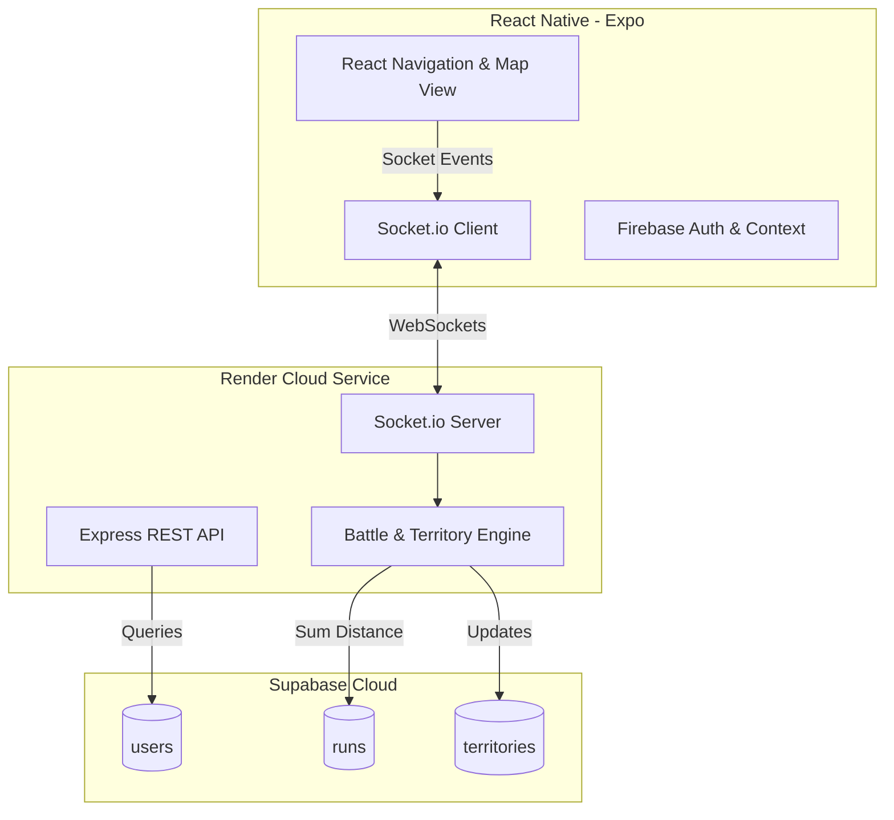
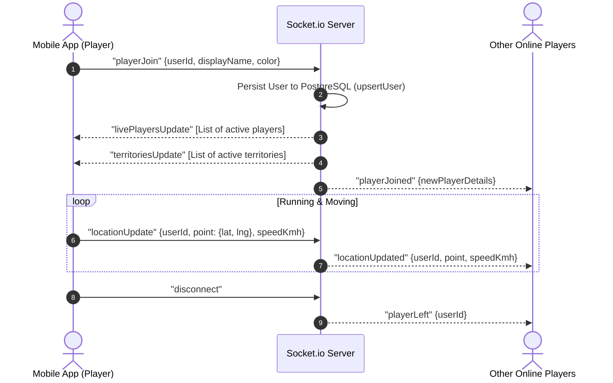
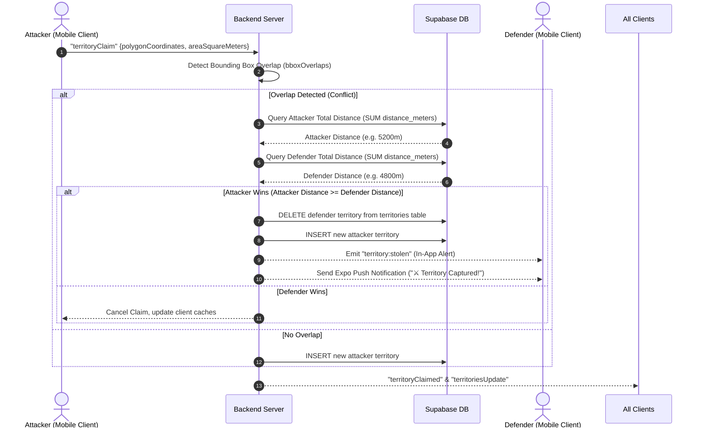

# 🛠️ RunWars Technical Documentation & Architecture Manual

RunWars is a real-time, gamified running application where players claim physical territories on a map by running in closed loops. The backend uses a hybrid architecture combining persistent relational storage with a real-time event-driven synchronization engine.

---

## 🏗️ System Architecture Overview

The system is organized as a monorepo consisting of three main packages:
1. **`apps/mobile`**: React Native (Expo) client application.
2. **`apps/backend`**: Express.js server integrated with Socket.io for real-time state sync.
3. **`packages/shared`**: Shared TypeScript types, utility functions, and schema definitions.



---

## 🗄️ Database Schema & Data Models

The database is hosted on **Supabase** with the `postgis` spatial extension enabled (available for future geographic spatial queries). Current coordinates are stored as optimized `JSONB` for robust cross-platform synchronization.

### 1. `users` Table
Stores authentication details, profile info, and custom runner details.
* **`id`** (`VARCHAR(128)`, PK): Matches Firebase Auth UID.
* **`email`** (`VARCHAR(255)`): Email address.
* **`display_name`** (`VARCHAR(100)`): Public username.
* **`avatar_url`** (`TEXT`): Profile picture (base64 string or URL).
* **`bio`** (`TEXT`): User bio.
* **`character_type`** (`VARCHAR(50)`): Selected avatar class (e.g., Runner, Knight, Cyber).
* **`color`** (`VARCHAR(20)`): Player's map color hex code.
* **`created_at`** (`TIMESTAMP`): Creation timestamp.

### 2. `runs` Table
Saves historical running records, route paths, and total distances.
* **`id`** (`SERIAL`, PK): Auto-incrementing identifier.
* **`user_id`** (`VARCHAR(128)`, FK): References `users(id)`.
* **`route_points`** (`JSONB`): Array of coordinate objects `[{latitude: X, longitude: Y, timestamp: Z}]`.
* **`distance_meters`** (`FLOAT`): Total distance run during the session.
* **`created_at`** (`TIMESTAMP`): Session completion timestamp.

### 3. `territories` Table
Tracks active map claims.
* **`id`** (`VARCHAR(64)`, PK): Unique territory ID (`terr_timestamp_userId`).
* **`owner_id`** (`VARCHAR(128)`, FK): References `users(id)`.
* **`polygon_coordinates`** (`JSONB`): Array of coordinates outlining the claim polygon.
* **`area_square_meters`** (`FLOAT`): Square footage of the territory.
* **`color`** (`VARCHAR(20)`): Map color at the time of claim.
* **`run_session_id`** (`VARCHAR(64)`): Links to the run session that generated the claim.
* **`claimed_at`** (`TIMESTAMP`): Claim timestamp.

---

## 📡 Real-time Data Flows & Lifecycles

### 🚀 1. Player Live Movement Sync
Tracks active runners on the map. Every coordinate change is broadcasted in real time to nearby runners using persistent WebSockets.



---

### ⚔️ 2. Territory Claiming & Conflict Resolution (Battle Engine)
When a runner closes their loop, they trigger a territory claim. If the loop overlaps with another runner's territory, a conflict is initiated. The winner is determined by comparing their lifetime running distance.



---

## 📂 Code Repository Directory Structure

```text
runwars-monorepo/
├── packages/
│   └── shared/                  # Shared domain types & constants
│       └── src/
│           └── index.ts         # LivePlayerState, Territory schemas
├── apps/
│   ├── backend/                 # Node.js Express + Socket.io Server
│   │   ├── src/
│   │   │   ├── db/
│   │   │   │   ├── index.ts     # PostgreSQL Client Pool
│   │   │   │   ├── migrate-db.ts# Database Migrator
│   │   │   │   └── schema.sql   # SQL DB Schema
│   │   │   └── server.ts        # Main WebSocket router & Battle Engine
│   │   ├── package.json
│   │   └── tsconfig.json
│   └── mobile/                  # React Native Expo Client
│       ├── src/
│       │   ├── components/      # Map Overlays & Custom UI components
│       │   ├── context/         # Auth, Theme and State context
│       │   ├── navigation/      # Stack & Tab Navigators
│       │   ├── screens/         # Run, Profile, Leaderboard screens
│       │   └── services/        # Firebase Auth & Socket.io services
│       ├── App.tsx              # Main entry point
│       └── app.json             # Expo project configuration
└── package.json                 # Monorepo Workspace Configuration
```

---

## ⚠️ Known Constraints & Future Architecture Notes

### 📱 1. Feed Screen Announcements limitation (Mobile App constraint)
* **The Constraint:** The present build of the mobile app (`FeedScreen.tsx`) has hardcoded system messages. In addition, when fetching the feed from `GET /territories`, the app maps all entries with hardcoded `type: 'claim'` and formatting ``message: `Claimed a new zone of ${Math.round(t.areaSquareMeters)} m²!```. Because of this mapping function in the present compiled build, any custom broadcast notifications injected directly into `/territories` on the backend will show up on the app's Feed with `"Claimed a new zone of 0 m²!"`.
* **Next Release Action:** 
  1. Add a dedicated announcements database table and a `GET /api/announcements` REST endpoint to the backend.
  2. In the next mobile app build, update `FeedScreen.tsx` to fetch both `/territories` and `/api/announcements` to merge them dynamically, allowing server-side announcements to render natively as proper system card types with correct headers and megaphones.

